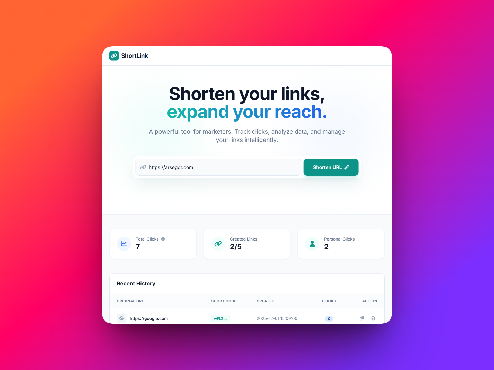
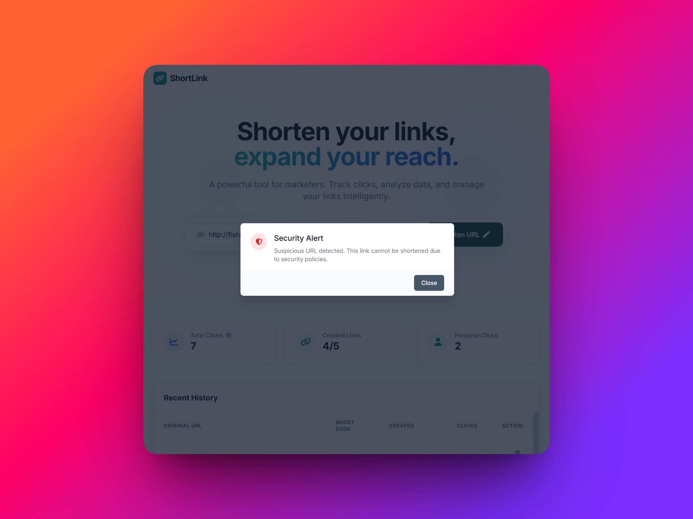

# ShortLink 🔗

**ShortLink** is a modern web application for URL shortening, designed to be fast, secure, and easy to use. It allows users to generate short links, track click statistics, and manage their links through a clean interface.


<br>
<p align="center">
  
</p>
<br>
<br>
<p align="center">
  
</p>
<br>
<br>
<p align="center">
  
</p>
<br>

## ✨ Features

* **URL Shortening:** Instantly convert long URLs into short, manageable codes.
* **Analytics:**
    * Global click counter (community total).
    * Individual link click tracking.
    * User-specific link history.
* **Link Management:**
    * **Smart Limit:** Users are limited to 5 active links to ensure fair usage (managed via LocalStorage/Database).
    * **Delete Function:** Remove old links to free up space for new ones.
    * **Quick Copy:** Copy short URLs to clipboard with a single click.
* **Security:**
    * Validates real URLs before shortening.
    * Blocks suspicious URLs.
* **Modern UI:** Fully responsive design built with Tailwind CSS.

## 📂 Project Structure

The project follows a modular structure organized within the `src` folder:

```
├── assets/             # Images for repo
│   ├── repoimgHome.png
│   ├── repoimgLimitAlert.png
│   └── repoimgSecurityAlert.png
├── database/           # SQLite database files
│   ├── links.db
│   └── seed.py         # Script to initialize DB (optional)
├── src/                # Main source code
│   ├── static/         # Static files (CSS, JS, Images)
│   │   ├── js/
│   │   │   └── main.js
│   │   └── style.css
│   ├── templates/      # HTML Templates
│   │   └── index.html
│   ├── app.py          # Application entry point
│   ├── main_routes.py  # Route definitions and API endpoints
│   ├── models.py       # Database models (SQLAlchemy)
│   └── utils.py        # Helper functions (Code generator, validations)
├── requirements.txt    # Project dependencies
└── README.md           # Documentation
```

## 🚀 Installation & Setup
Follow these steps to run the project locally:
```
git clone https://github.com/nicoars1/shortlinks
cd shortlink
```
2. Create a Virtual Environment
```
# Windows
python -m venv env
.\env\Scripts\activate

# Mac/Linux
python3 -m venv env
source env/bin/activate
```
3. Install Dependencies
```
pip install -r requirements.txt
```
4. Database Setup
The application is configured to create the database tables automatically upon launch if they don't exist. Ensure the database/ folder exists in the root directory.

5. Run the Application
```
python src/app.py
```
## 🛠️ Tech Stack
Backend: Python, Flask, Flask-SQLAlchemy.

Database: SQLite.

Frontend: HTML5, CSS3, JavaScript.

Styling: Tailwind CSS (via CDN).

Icons: FontAwesome.

## 🤝 Contributing
Contributions are welcome!

## 📄 License
This project is open source and available under the MIT License.
